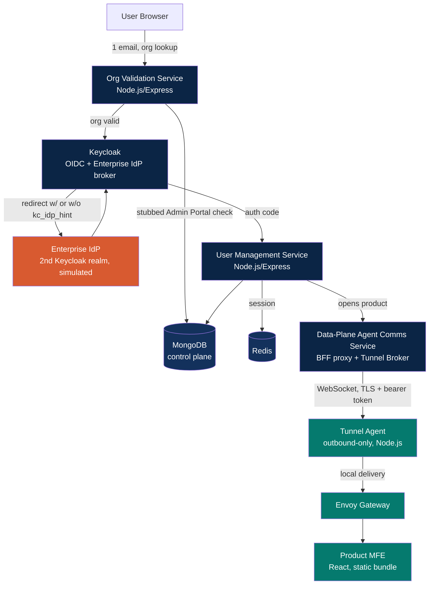

# POC Plan: Control Plane / Data Plane Architecture Validation

**Purpose:** prove the architecture works — not build the product. Scope is deliberately narrow: six services, one login flow, three cloud combinations.

---

## 1. Objectives and success criteria

| # | Objective | Success criterion |
|---|---|---|
| 1 | Control plane on AWS, data plane on Azure | Tunnel agent (Azure) connects outbound to the broker (AWS); Azure side has **zero inbound listeners** reachable from the internet; login completes end to end |
| 2 | Control plane on AWS, data plane on AWS | Same tunnel mechanism works within one cloud (validates the design doesn't secretly depend on cross-cloud specifics) |
| 3 | Control plane on AWS, data plane on GCP | Same as #1, proving the mechanism is genuinely cloud-agnostic, not AWS/Azure-specific |
| 4 | End-to-end login validated | Every step in the attached flow diagram is observably exercised — see Section 8 checklist |

A run counts as successful only if, for every data-plane target, a network scan from outside shows **no open inbound port** on the data-plane host/service, while the control plane can still reach it through the tunnel.

---

## 2. Scope

**In scope (six services, matching what you listed):**

Control plane:
- Org Validation Service
- User Management Service
- Keycloak OIDC + Enterprise IdP federation
- Data-Plane Agent Comms Service (BFF proxy module + embedded Tunnel Broker)

Data plane:
- Envoy Gateway
- Tunnel Agent

Plus the minimum supporting cast needed to make login actually work: MongoDB (control plane), Redis (sessions), a minimal React App Shell, and one minimal React product micro-frontend served from the data plane.

**Explicitly out of scope for this POC** (deferred from the full platform design already documented separately): Gravitino, Authorization Gateway, Role Sync Worker, Admin Portal's real implementation (stub it), Support Portal, billing, Temporal, the monitoring/telemetry pipeline, ArgoCD/GitOps, credential vending, and any dbt/Kafka Connect/Flink integration. None of these are needed to prove the thing this POC exists to prove.

**One deliberate simplification worth flagging up front:** the production design uses certificate-pinned mTLS for the tunnel. For POC speed, use **TLS + a per-tenant bearer token** instead of full mTLS cert issuance/rotation. This still proves the core claim (outbound-only, no inbound port, broker can't decrypt payload if you layer TLS-passthrough) without building a certificate lifecycle management system for a throwaway POC. Call this out explicitly in the demo so it isn't mistaken for the production security posture.

---

## 3. Architecture (POC scope only)



The **data plane block** (`TunnelAgent`, `Envoy`, `ProductMFE`) is what gets redeployed three times — once per cloud in objectives 1–3. Everything else stays fixed on AWS.

---

## 4. Component design

### 4.1 Org Validation Service
- Node.js + Express, single endpoint: `POST /validate-org { email }` → `{ orgId, valid, idpAlias }`.
- Since the real Admin Portal isn't in scope, stub it as an in-memory or MongoDB-backed lookup table seeded with 2–3 test orgs, one with `idpAlias` set (enterprise IdP path) and one without (native Keycloak path) — this is what lets the POC exercise both branches of the login flow.

### 4.2 User Management Service
- Node.js + Express + MongoDB. Minimal collections: `users`, `sessions`.
- Owns the `/auth/callback` code exchange and session creation (`express-session` + `connect-redis`), matching the design already agreed on for the full BFF.

### 4.3 Keycloak OIDC + Enterprise IdP
- Run a real Keycloak instance (Docker image, official `quay.io/keycloak/keycloak`).
- **Simulate the enterprise IdP with a second Keycloak realm**, configured as a SAML or OIDC identity provider broker on the first realm. This is a standard testing pattern — it exercises the exact same brokering code path (identity provider mappers, first broker login, `kc_idp_hint`) without needing a real Okta/Azure AD tenant for the POC.
- One realm = "InAiEra," one realm = "Acme" (the simulated customer IdP), broker-linked.

### 4.4 Data-Plane Agent Comms Service
- Node.js service combining two roles for POC simplicity: the BFF's proxy middleware, and the Tunnel Broker itself (in production these could stay logically separate; combining them removes one deployable for the POC without changing what's being proven).
- Uses the `ws` library. Maintains a map of `tenantId → open WebSocket connection` from connected agents.
- Exposes an internal method: given a tenant ID and an HTTP request, serialize it, send over that tenant's socket, await the response frame, return it to the calling BFF code.

### 4.5 Tunnel Agent
- Node.js, runs in the data-plane environment. On startup, opens a `wss://` connection to the Comms Service, authenticated with a bearer token unique to that tenant/environment (env var, not committed to source).
- On receiving a relayed request frame, performs a local HTTP call to Envoy and streams the response back over the same socket.
- No listening socket opened anywhere in this process — outbound connection only, which is the property the whole POC exists to demonstrate.

### 4.6 Envoy Gateway
- Real Envoy, minimal config: a single route to the product MFE's static file server, plus the `jwt_authn` HTTP filter validating whatever session/DPAT-equivalent token the POC uses (a simplified single-token model is fine here — full DPAT/RFC 8693 token exchange can be stubbed as "always mint a token scoped to this one data plane," since Authorization Gateway/Gravitino-level nuance is out of scope).

### 4.7 Frontend
- App Shell: React + Vite, minimal Module Federation host, single nav item pointing at the one product MFE.
- Product MFE: React, minimal remote exposing one component, built and served as static files from wherever the data plane runs (a simple `serve`/nginx container is enough).

---

## 5. Repo structure

```
poc-control-data-plane/
├── control-plane/
│   ├── org-validation-service/
│   ├── user-management-service/
│   ├── agent-comms-service/        # BFF proxy + Tunnel Broker
│   ├── keycloak/                   # realm export JSON for both realms
│   └── app-shell/                  # React host
├── data-plane/
│   ├── tunnel-agent/
│   ├── envoy/                      # envoy.yaml
│   └── product-mfe/                # React remote
├── infra/
│   ├── aws-control-plane/          # Terraform: always used
│   ├── aws-data-plane/             # Terraform: objective 2
│   ├── azure-data-plane/           # Terraform: objective 1
│   └── gcp-data-plane/             # Terraform: objective 3
├── docker-compose.local.yml        # full stack, loopback tunnel, for local dev
└── README.md
```

---

## 6. Multi-cloud deployment plan

To keep the POC's own footprint small, skip full Kubernetes for the data-plane targets and use each cloud's simplest managed-container runtime — this is a deliberate POC-only divergence from the production EKS/AKS/GKE plan, since standing up three managed Kubernetes clusters just to prove a networking pattern is disproportionate effort for this exercise.

| Objective | Control plane | Data plane runtime |
|---|---|---|
| 1 | AWS (ECS Fargate or a single App Runner service) | **Azure Container Apps** |
| 2 | AWS (same) | **AWS ECS Fargate** (separate task from control plane) |
| 3 | AWS (same) | **GCP Cloud Run** |

Terraform per data-plane target is a thin wrapper: one container/service definition (Tunnel Agent + Envoy + product MFE as sibling containers or separate services), outbound egress only, explicitly **no public ingress resource created at all** — the absence of an ingress/load-balancer resource in the Terraform is itself part of what you're proving.

---

## 7. Tunnel protocol sketch (POC version)

```
Agent → Comms Service (on connect):
  { type: "register", tenantId, token }

Comms Service → Agent (on relay):
  { type: "request", requestId, method, path, headers, body }

Agent → Comms Service (on response):
  { type: "response", requestId, status, headers, body }
```

Simple request/response framing over one persistent socket per tenant. No need for HTTP/2 multiplexing or anything fancier at POC scale — a handful of concurrent requests per tenant is enough to prove the pattern.

---

## 8. End-to-end login validation checklist

Direct checklist against the attached flow diagram, step by step:

- [ ] Browser enters work email → Org Validation Service called
- [ ] Org Validation Service checks the stubbed org record, returns valid/invalid
- [ ] Invalid org: login blocked, **no redirect to Keycloak occurs** (verify via network tab — this is the "fail before redirect" property from the earlier design correction)
- [ ] Valid org, no `idpAlias`: redirected to Keycloak's native login page
- [ ] Valid org, with `idpAlias`: redirected to Keycloak with `kc_idp_hint`, which forwards to the "Acme" realm
- [ ] Password entered at the Acme realm — confirm via Keycloak admin console that the InAiEra realm never received credentials directly
- [ ] Keycloak issues a signed token; browser returns to `/auth/callback` with a code, not a token
- [ ] User Management Service exchanges the code server-side; browser only ever receives a session cookie
- [ ] Session confirmed via a `GET /auth/session` check
- [ ] Opening the product triggers a request through the Agent Comms Service
- [ ] Packet capture / `netstat` on the data-plane host confirms **no listening socket** other than the outbound connection already established
- [ ] Envoy receives the relayed request, validates the token, serves the product MFE
- [ ] Repeat this entire checklist for each of the three cloud targets

---

## 9. Suggested build sequence

1. **Local loopback**: full stack via `docker-compose.local.yml`, tunnel agent and comms service both on localhost — proves the WebSocket relay mechanism works before any cloud is involved.
2. **Objective 2 first** (AWS → AWS): fewest new variables, validates the deployment pattern itself.
3. **Enterprise IdP brokering**: add the second Keycloak realm, validate both login branches locally before moving to other clouds.
4. **Objective 1** (AWS → Azure): first genuine cross-cloud run.
5. **Objective 3** (AWS → GCP): confirms the mechanism generalizes rather than having accidentally depended on something Azure-specific.
6. **Full checklist (Section 8) against all three targets**, network scan included, as the final acceptance step.

---

## 10. What this POC proves and does not prove

**Proves:** the outbound-only tunnel pattern works identically across three different clouds; the org-validation-before-redirect ordering is enforceable; enterprise IdP brokering works through Keycloak; a browser can reach a data-plane-hosted MFE without the data plane ever exposing an inbound port.

**Does not prove:** production-grade certificate lifecycle management (POC uses bearer tokens), Gravitino-based RBAC, the Authorization Gateway, role propagation, or anything about scale/performance under real concurrent load. Treat a successful POC as license to proceed with the full design, not as validation of those deferred pieces.
